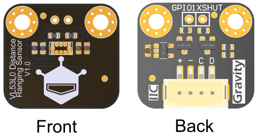

# DFRobot_CardReader

* [中文版](./README_CN.md)



## Product Link（ https://www.dfrobot.com/ ）
    
## Table of Contents

* [Summary](#summary)
* [Installation](#installation)
* [Methods](#methods)
* [Compatibility](#compatibility)
* [History](#history)
* [Credits](#credits)

## Summary
This directory provides the methods for driving this module on the line board K10 and the line board M10. micropython is the driver for K10 and python is the driver for M10

## Methods
```Python
    #行空板K10 MicoPython的init办法
    def __init__(self,scl=48,sda=47,bus=0)
      """!
      @brief Module I2C communication init
      @param i2c_addr - I2C communication address
      @param bus_num - I2C bus
      """
    #行空板M10 Python的init办法
    def __init__(self,bus=4)
        """!
        @brief Module I2C communication init
        @param i2c_addr - I2C communication address
        @param bus_num - I2C bus
        """
    def begin(self)
        """!
        @brief Function begin.
        @return Boolean type, the result of operation
        """
    def scan(uuid="")
        """!
        @brief Scan to determine whether there is a NFC smart card/tag.
        @return Boolean type, the result of operation
        @retval true means find out a MIFARE Classic card.
        @retval false no card
        """
    def read_uid()
        """!
        @brief Obtain the UID of the card.
        @return UID of the card.
        """
    def write_block(self, block,data,index=0)
        """!
        @brief Write a byte to a MIFARE Classic NFC smart card/tag.
        @param block - The number of pages you want to writes the data.
        @param index - The offset of the data.
        @param data - The byte to be written.
        @return Boolean type, the result of operation
        """
    def read_block(self, block, index=None)
        """!
        @brief Read a byte from a specified block of a MIFARE Classic NFC smart card/tag.
        @param block - The number of the block to read from.
        @param index - The offset of the block.
        @return Read from the card.
        """
```

## Compatibility

MCU                | Work Well    | Work Wrong   | Untested    | Remarks
------------------ | :----------: | :----------: | :---------: | -----
unihiker K10        |      √       |              |             | 
unihiker M10        |      √       |              |             | 


## History

- Date 2025-02-08
- Version V0.1
## Credits
Written by fary(feng.yang@dfrobot.com), 2025.02.08 (Welcome to our [website](https://www.dfrobot.com/))