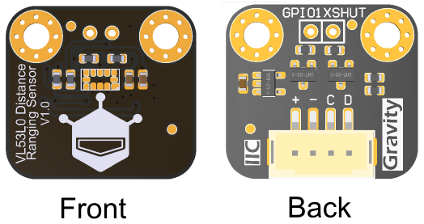

# DFRobot_CardReader

* [English Version](./README.md)




## 产品链接（ https://www.dfrobot.com.cn/ ）


## 目录

* [简介](#简介)
* [方法](#方法)
* [兼容性](#兼容性)
* [历史](#历史)
* [贡献者](#贡献者)

## 简介
本目录提供了行空板K10已经行空板M10驱动本模块的办法，micropython为K10的驱动方法，python为M10的驱动方法
## 方法
```Python
    #行空板K10 MicoPython的init办法
    def __init__(self,scl=48,sda=47,bus=0)
      """!
      @brief Module I2C communication init
      @param i2c_addr - I2C communication address
      @param bus_num - I2C bus
      """
    #行空板M10 Python的init办法
    def __init__(self,bus=4)
        """!
        @brief Module I2C communication init
        @param i2c_addr - I2C communication address
        @param bus_num - I2C bus
        """
    def begin(self)
        """!
        @brief Function begin.
        @return Boolean type, the result of operation
        """
    def scan(uuid="")
        """!
        @brief Scan to determine whether there is a NFC smart card/tag.
        @return Boolean type, the result of operation
        @retval True means find out a MIFARE Classic card.
        @retval False no card
        """
    def read_uid()
        """!
        @brief Obtain the UID of the card.
        @return UID of the card.
        """
    def write_block(self, block,data,index=0)
        """!
        @brief Write a byte to a MIFARE Classic NFC smart card/tag.
        @param block - The number of pages you want to writes the data.
        @param index - The offset of the data.
        @param data - The byte to be written.
        @return Boolean type, the result of operation
        """
    def read_block(self, block, index=None)
        """!
        @brief Read a byte from a specified block of a MIFARE Classic NFC smart card/tag.
        @param block - The number of the block to read from.
        @param index - The offset of the block.
        @return Read from the card.
        """
```


## 兼容性

开发板                | 表现良好	|表现异常	|未测试	|备注 |
------------------ | :----------: | :----------: | :---------: | -----

行空板K10        |      √       |              |             | 
行空板M10        |      √       |              |             | 

## 历史

- Date 2025-02-08
- Version V0.1


## 贡献者

Written by fary(feng.yang@dfrobot.com), 2025.02.08 (Welcome to our [website](https://www.dfrobot.com/))
